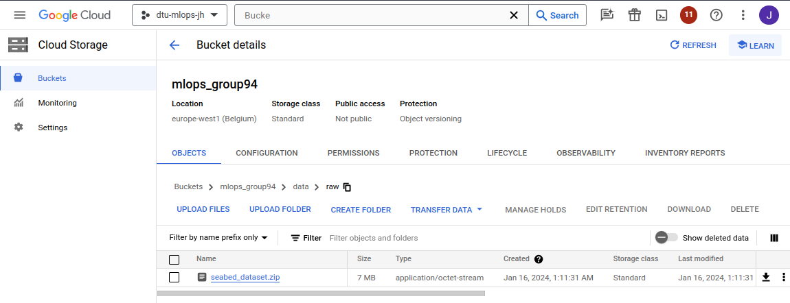
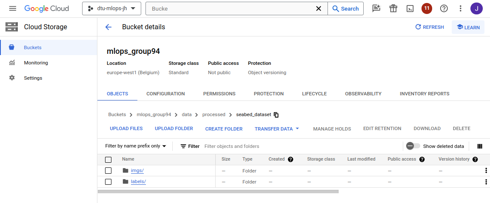

# Exam template for 02476 Machine Learning Operations

This is the report template for the exam. Please only remove the text formatted as with three dashes in front and behind
like:

```--- question 1 fill here ---```

where you instead should add your answers. Any other changes may have unwanted consequences when your report is auto
generated in the end of the course. For questions where you are asked to include images, start by adding the image to
the `figures` subfolder (please only use `.png`, `.jpg` or `.jpeg`) and then add the following code in your answer:

```markdown

```

In addition to this markdown file, we also provide the `report.py` script that provides two utility functions:

Running:

```bash
python report.py html
```

will generate an `.html` page of your report. After deadline for answering this template, we will autoscrape
everything in this `reports` folder and then use this utility to generate an `.html` page that will be your serve
as your final handin.

Running

```bash
python report.py check
```

will check your answers in this template against the constrains listed for each question e.g. is your answer too
short, too long, have you included an image when asked to.

For both functions to work it is important that you do not rename anything. The script have two dependencies that can
be installed with `pip install click markdown`.

## Overall project checklist

The checklist is *exhaustic* which means that it includes everything that you could possible do on the project in
relation the curricilum in this course. Therefore, we do not expect at all that you have checked of all boxes at the
end of the project.

### Week 1

* [x] Create a git repository
* [x] Make sure that all team members have write access to the github repository
* [x] Create a dedicated environment for you project to keep track of your packages
* [x] Create the initial file structure using cookiecutter
* [x] Fill out the `make_dataset.py` file such that it downloads whatever data you need and
* [x] Add a model file and a training script and get that running
* [x] Remember to fill out the `requirements.txt` file with whatever dependencies that you are using
* [x] Remember to comply with good coding practices (`pep8`) while doing the project
* [x] Do a bit of code typing and remember to document essential parts of your code
* [x] Setup version control for your data or part of your data
* [x] Construct one or multiple docker files for your code
* [x] Build the docker files locally and make sure they work as intended
* [x] Write one or multiple configurations files for your experiments
* [x] Used Hydra to load the configurations and manage your hyperparameters
* [ ] When you have something that works somewhat, remember at some point to to some profiling and see if
      you can optimize your code
* [x] Use Weights & Biases to log training progress and other important metrics/artifacts in your code. Additionally,
      consider running a hyperparameter optimization sweep.
* [x] Use Pytorch-lightning (if applicable) to reduce the amount of boilerplate in your code

### Week 2

* [x] Write unit tests related to the data part of your code
* [ ] Write unit tests related to model construction and or model training
* [x] Calculate the coverage.
* [x] Get some continuous integration running on the github repository
* [x] Create a data storage in GCP Bucket for you data and preferable link this with your data version control setup
* [x] Create a trigger workflow for automatically building your docker images
* [x] Get your model training in GCP using either the Engine or Vertex AI
* [x] Create a FastAPI application that can do inference using your model
* [ ] If applicable, consider deploying the model locally using torchserve
* [x] Deploy your model in GCP using either Functions or Run as the backend

### Week 3

* [ ] Check how robust your model is towards data drifting
* [ ] Setup monitoring for the system telemetry of your deployed model
* [ ] Setup monitoring for the performance of your deployed model
* [x] If applicable, play around with distributed data loading
* [ ] If applicable, play around with distributed model training
* [ ] Play around with quantization, compilation, and pruning for your trained models to increase inference speed

### Additional

* [x] Revisit your initial project description. Did the project turn out as you wanted?
* [x] Make sure all group members have an understanding about all parts of the project
* [x] Uploaded all your code to GitHub

## Group information

### Question 1
> **Enter the group number you signed up on <learn.inside.dtu.dk>**
>
> Answer:

94

### Question 2
> **Enter the study number for each member in the group**
>
> Example:
>
> *sXXXXXX, sXXXXXX, sXXXXXX*
>
> Answer:

s240572, s240522

### Question 3
> **What framework did you choose to work with and did it help you complete the project?**
>
> Answer length: 100-200 words.
>
> Example:
> *We used the third-party framework ... in our project. We used functionality ... and functionality ... from the*
> *package to do ... and ... in our project*.
>
> Answer:

In our project, we harnessed the power of the PyTorch Framework, coupled with the PyTorch Lightning extension, to comprehensively develop, train, and evaluate our deep learning model. This dynamic combination facilitated a streamlined workflow, utilizing PyTorch's dynamic computation graph and user-friendly interface alongside the enhanced structure provided by PyTorch Lightning. In addition to torchvision, we integrated the ResNet model as a baseline, leveraging its robust features. The PyTorch Lightning extension further simplified the training process, enabling us to focus on model fine-tuning and optimization for our specific deep learning task. Together, these tools formed a cohesive and efficient framework for our project. We also used multiple "utility" libraries - such as numpy and pandas for data manipulation, hydra for congifuration, wandb for tracking and storing our experiments, GCP SDK (google-cloud-secret-manager etc.), followed with libraries like dvc, pytest, coverage and fastapi with uvicorn for deploying our model.

## Coding environment

> In the following section, we want to learn more about your local development environment.

### Question 4

> **Explain how you managed dependencies in your project? Explain the process a new team member would have to go**
> **through to get an exact copy of your environment.**
>
> Answer length: 100-200 words
>
> Example:
> *We used ... for managing our dependencies. The list of dependencies was auto-generated using ... . To get a*
> *complete copy of our development environment, one would have to run the following commands*
>
> Answer:

**Python dependencies:**
We use a dedicated virtual Python environment for dependency management with all the dependencies specified in `requirements.txt` (for "production" requirements) and `requirements_dev` for dependencies necessary only for development. To create the environment, run `make create_environment` and to activate it, you can get the command using `make activate_environment` or just directly run `source env_dtu_mlops_team94/bin/activate`. To install the dependencies for development run `make dev_requirements` or in production `make requirements`.

**Data dependencies:**
For managing data dependencies we use DVC and GCP Cloud Storage Buckets. So first, you have to [download GCP SDK](https://cloud.google.com/sdk/docs/install) and login yourself, there are two options for that:
1. Use your account, that has access to the Bucket => `gcloud auth login`
2. Use Service Account (which has r/w right to the Bucket) => `gcloud auth activate-service-account --key-file=<json-private-key-downloaded-from-GCP-IAM>`,

When you are authenticated, run `dvc pull`. Lastly, preparing the dataset by running `make data` is necessary.

Additionally, the new member should also enable `pre-commit` by running `pre-commit install`

### Question 5

> **We expect that you initialized your project using the cookiecutter template. Explain the overall structure of your**
> **code. Did you fill out every folder or only a subset?**
>
> Answer length: 100-200 words
>
> Example:
> *From the cookiecutter template we have filled out the ... , ... and ... folder. We have removed the ... folder*
> *because we did not use any ... in our project. We have added an ... folder that contains ... for running our*
> *experiments.*
> Answer:

From the cookiecutter template we have filled out the following folders:
```
|- `data` - contains the raw data, which is downloaded from the GCP Bucket using DVC
|---- `raw` - contains the raw data, which is downloaded from the GCP Bucket using DVC - contains a ZIP file with the raw data
|---- `processed` - contains the processed data, which is created by `make data` command
|
|- `docs` - we've put in a few pieces of documentation - mainly how to run the Vertex AI training job, etc. However as we are only 2 in the group, we prioritized doing the project tasks over writing exhaustive documentation.
|
|- `models` - contains our trained models (more specifically, the weights of the model - the architecture of our `SeabedClassifier` is defined in `dtu_mlops_team94/models/model.py`)
|
|- `reports` - contains the report in Markdown format (this file) and the generated HTML file
|
|- `tests` - contains the unit tests (at the time of writing this, there are only tests for the data)
|
|- `dtu_mlops_team94` - contains the source code of our project
|---- `data` - contains the code for downloading and processing the data, `SeabedDataset` class, and a `SamplersFactory` used to create the samplers for the training, validation, and testing datasets
|---- `models` - contains the code for the model architecture
```

We have added this:
```
|- `dtu_mlops_team94``
|---- `utils` - contains utility functions used in the project
```

We have not used these directories:
```
|- `notebooks` - we did not use any Jupyter notebooks
|- `dtu_mlops_team94/visualization` - we did not use any visualizations (except for the W&B dashboard, but that is online)
```

### Question 6

> **Did you implement any rules for code quality and format? Additionally, explain with your own words why these**
> **concepts matters in larger projects.**
>
> Answer length: 50-100 words.
>
> Answer:

We have installed *ruff* linter (and formatter) and configured it to run on every commit. We also use a ruff extension in VSCode, which allows us to format our code effortlessly. These concepts are important in larger projects because they help keep the code consistent and readable. This is especially important when working in a team because it helps avoid confusion and makes it easier to understand the code written by other team members.

## Version control

> In the following section we are interested in how version control was used in your project during development to
> corporate and increase the quality of your code.

### Question 7

> **How many tests did you implement and what are they testing in your code?**
>
> Answer length: 50-100 words.
>
> Example:
> *In total we have implemented X tests. Primarily we are testing ... and ... as these the most critical parts of our*
> *application but also ... .*
>
> Answer:

In total, when writing this answer, we implemented 4 tests. They are testing our dataset handling code's data loading, structure, and processing part. We have not implemented any tests for the model training part, because we did not have enough time to do that (as we are only 2 and we wanted to get hands-on experience from as many tasks as possible and to possibly focus on things that bring the most value to the business).

### Question 8

> **What is the total code coverage (in percentage) of your code? If you code had an code coverage of 100% (or close**
> **to), would you still trust it to be error free? Explain you reasoning.**
>
> Answer length: 100-200 words.
>
> Example:
> *The total code coverage of code is X%, which includes all our source code. We are far from 100% coverage of our **
> *code and even if we were then...*
>
> Answer:

The total code coverage of code is 48 %. We should improve that as we are aware, that this is a technical debt. Even if we had 100% coverage, we would not trust it to be error-free, because there are still edge cases or possible utilization of some parts of our code that we did not think of. So having (almost) 100% coverage is good, but it does not mean the code is error-free and can't break. Just the chance of that happening is lower. Also, the benefit of 100% coverage is that it forces you to think about the edge cases and possible utilization of your code, which is always good.

### Question 9

> **Did you workflow include using branches and pull requests? If yes, explain how. If not, explain how branches and**
> **pull request can help improve version control.**
>
> Answer length: 100-200 words.
>
> Example:
> *We made use of both branches and PRs in our project. In our group, each member had a branch that they worked on in*
> *addition to the main branch. To merge code we ...*
>
> Answer:

We implemented the *Gitflow workflow*, a Git branching model that incorporates feature branches and multiple primary branches. Following this approach, we created a feature branch for each task on the checklist, working on and completing it independently. Once a feature was finished, we merged the corresponding feature branch into the development (dev) branch. The dev branch acts as an integration branch for all features. Our final, consolidated code will undergo merging into the main branch. This structured process facilitated collaboration, prevented an enormous amount of merge conflicts, and maintained a clean and organized version control system. There are other possible workflows, but we opted in for Gitflow workflow as it is well structured.

### Question 10

> **Did you use DVC for managing data in your project? If yes, then how did it improve your project to have version**
> **control of your data. If no, explain a case where it would be beneficial to have version control of your data.**
>
> Answer length: 100-200 words.
>
> Example:
> *We did make use of DVC in the following way: ... . In the end it helped us in ... for controlling ... part of our*
> *pipeline*
>
> Answer:

We used DVC to store our compressed dataset in a ZIP archive. Our dataset is a set of images for a CV classification task, which means that there can be quite a large number of files, thus the data transfer might be slow - so we chose to compress the dataset into a ZIP archive and store it in the GCP Bucket using DVC.
During the development, we also used DVC to store our trained models. Still, we switched to storing trained weights in *Weights & Biases* directly as Artifacts as there is a clear connection between the model training and the weights and it is more straightforward to use W&B for that.
Storing the dataset and models using DVC helped us keep track of the versions, changes, and authors of the changes and also easily share data between the team members.

### Question 11

> **Discuss you continues integration setup. What kind of CI are you running (unittesting, linting, etc.)? Do you test**
> **multiple operating systems, python version etc. Do you make use of caching? Feel free to insert a link to one of**
> **your github actions workflow.**
>
> Answer length: 200-300 words.
>
> Example:
> *We have organized our CI into 3 separate files: one for doing ..., one for running ... testing and one for running*
> *... . In particular for our ..., we used ... .An example of a triggered workflow can be seen here: <weblink>*
>
> Answer:

We have implemented 2 CI jobs so far. One for running our tests and the second for building a Docker image and pushing it to the Google Cloud Artifacts Registry to be used in the Vertex AI training job.

**[Testing workflow](https://github.com/xqubics/dtu_mlops_team94/blob/main/.github/workflows/test.yaml):** In this workflow we are using multiple "ready-made" GitHub Actions, namely:
- `actions/checkout@v2` - to checkout the repository - gets the code from the branch that triggered the workflow
- `actions/setup-python@v2` - to setup Python

Here we use the `python-version` parameter to specify the Python version. We might have also used multiple Python versions to test the app. This can be done by defining a `strategy` - described [here (GH docs)](https://docs.github.com/en/actions/automating-builds-and-tests/building-and-testing-python#using-multiple-python-versions)

Also in this step, we are using `cache` to cache the dependencies installed in the previous runs.

- `google-github-actions/auth@v2` - to authenticate with GCP using a Service Account JSON key stored as a secret in the repository

- `google-github-actions/setup-gcloud@v2` - to setup the GCP SDK

These two last steps are necessary to use DVC to download the dataset from the GCP Bucket.

Then we install the dependencies using `pip` and run the tests using `pytest`.

*Note: The commit editing this workflow failed because of incorrect secrets - you can see, that the workflow runs [here](https://github.com/xqubics/dtu_mlops_team94/actions)*

**[Building Docker images (for training and deployment) workflow](https://github.com/xqubics/dtu_mlops_team94/blob/main/.github/workflows/build_trainer.yaml):** In this workflow we are using the same actions to get access to the GCP, without the python setup.
Followed by steps to configure Docker with a Google Cloud Artifact Registry and then a `docker/build-push-action` step to build the images and push them to the registry with the tag `latest` and a tag with the current commit hash.

## Running code and tracking experiments

> In the following section we are interested in learning more about the experimental setup for running your code and
> especially the reproducibility of your experiments.

### Question 12

> **How did you configure experiments? Did you make use of config files? Explain with coding examples of how you would**
> **run a experiment.**
>
> Answer length: 50-100 words.
>
> Example:
> *We used a simple arg-parser, that worked in the following way: python my_script.py --lr 1e-3 --batch_size 25*
>
> Answer:

For managing multiple experiments, we used the Hydra framework. We have created a config file for each experiment, located in `dtu_mlops_team94/configs/experiments/`. To run an experiment, we can use this command:
```sh
python train_model.py experiment=experiment0.yaml
```
or using Docker image:
```sh
docker run trainer:latest experiment=experiment0.yaml
```
where `experiment0.yaml` is the name of the config file. We can also override any parameter in the config file using the Hydra syntax, e.g.:
```sh
python train_model.py experiment=experiment0.yaml dataset.batch_size=64
```

We have also created *project configuration* files for general project setup and *deployment configuration* files for setting up the deployment/training environment for the model.

### Question 13

> **Reproducibility of experiments are important. Related to the last question, how did you secure that no information**
> **is lost when running experiments and that your experiments are reproducible?**
>
> Answer length: 100-200 words.
>
> Example:
> *We made use of config files. Whenever an experiment is run the following happens: ... . To reproduce an experiment*
> *one would have to do ...*
>
> Answer:

To store the hyperparameters and other configurations for training the model, we used Hydra config files. We have created a config file for each experiment, located in `dtu_mlops_team94/configs/experiments/`. We have also specified a `seed` there, which is used to seed all the "random" operations in the code (e.g. shuffling the dataset, initializing the model weights, etc.). We have also used W&B to log the hyperparameters and other metrics, which helps us keep track of the experiments and reproduce them as we can see the exact configuration of the experiment, with the metrics and other artifacts - like trained model weights.

It should be sufficient to run the training with the same experiment config file, ideally in the created Docker image to reproduce the experiment.

### Question 14

> **Upload 1 to 3 screenshots that show the experiments that you have done in W&B (or another experiment tracking**
> **service of your choice). This may include loss graphs, logged images, hyperparameter sweeps etc. You can take**
> **inspiration from [this figure](figures/wandb.png). Explain what metrics you are tracking and why they are**
> **important.**
>
> Answer length: 200-300 words + 1 to 3 screenshots.
>
> Example:
> *As seen in the first image when have tracked ... and ... which both inform us about ... in our experiments.*
> *As seen in the second image we are also tracking ... and ...*
>
> Answer:


As seen in the picture, we employ comprehensive tracking of various metrics throughout our model evaluation process. We monitor training accuracy and loss, validation and loss, and crucial test loss. The training accuracy and loss serve as fundamental indicators during the learning process. Training accuracy reflects how well the model learns from the training data, while training loss quantifies the disparity between predicted and actual values. The primary goal is to minimize training loss to achieve optimal model fitting.

Moving beyond the training phase, validation accuracy and loss become pivotal metrics that provide insights into the model's generalization capabilities. Validation accuracy assesses the model's performance on an unseen dataset, aiding in detecting overfitting or underfitting. Simultaneously, validation loss reflects the error on this separate dataset, contributing to the continuous evaluation of the model's progress and adjustment needs.


The final checkpoint in evaluating a model is the test loss, as seen in the second image, measured on a completely new and unseen dataset. Test loss is the ultimate metric for assessing a model's overall performance and readiness for real-world applications.

Collectively, these metrics—training accuracy and loss, validation and loss, and test loss—form a comprehensive framework for understanding, refining, and validating the effectiveness of machine learning models. The integration of these metrics allows for a nuanced and thorough assessment, ensuring robust and reliable model performance.

### Question 15

> **Docker is an important tool for creating containerized applications. Explain how you used docker in your**
> **experiments? Include how you would run your docker images and include a link to one of your docker files.**
>
> Answer length: 100-200 words.
>
> Example:
> *For our project we developed several images: one for training, inference and deployment. For example to run the*
> *training docker image: `docker run trainer:latest lr=1e-3 batch_size=64`. Link to docker file: <weblink>*
>
> Answer:

For our project, we have developed, two Docker images - one used for training the model in Vertex AI (or locally), second for deploying our FastAPI app serving our model on Cloud Run (or locally). To build the images locally, run the following:
```sh
# train-model image
docker build -t trainer:latest -f dockerfiles/train_model.dockerfile .

# deploy-model-app image
docker build -t deploy-app:latest -f dockerfiles/deploy_model_app.dockerfile .
```
But note, that the Dockerfile are built automatically using GitHub Actions and pushed to the GCP Artifacts Registry, so there is no need to build it locally.

To run the Docker images (built locally), run:
```sh
# train the model
docker run trainer:latest

# run the deployed model
docker run -e PORT=8080 -p 8080:8080 deploy-app:latest
```

optionally, you can specify arguments for the training image:
```sh
  docker run trainer:latest \
    experiment=experiment[X].yaml \
    deployment.wandb.api_key=[FILL_IN_YOUR_WANDB_API_KEY]
```
or any other Hydra overrides, like dataset path, are used to run the training in Vertex AI.

To run it on Vertex AI, after being logged in with a Service Account, run:
```sh
gcloud ai custom-jobs create --region=europe-west1 --display-name=team94-train --config=train_vertex.json
```
Image for serving our model is deployed using Cloud Run. It can be also updated by running:
```sh
gcloud run deploy deploy-model-app --image europe-west1-docker.pkg.dev/dtu-mlops-jh/mlops-team94/deploy-model-app:latest --platform managed --region europe-west1 --allow-unauthenticated
```

Here you can find the Dockerfile: [train_model.dockerfile](https://github.com/xqubics/dtu_mlops_team94/blob/main/dockerfiles/train_model.dockerfile)
or [deploy_model_app.dockerfile](https://github.com/xqubics/dtu_mlops_team94/blob/main/dockerfiles/deploy_model_app.dockerfile)

### Question 16

> **When running into bugs while trying to run your experiments, how did you perform debugging? Additionally, did you**
> **try to profile your code or do you think it is already perfect?**
>
> Answer length: 100-200 words.
>
> Example:
> *Debugging method was dependent on group member. Some just used ... and others used ... . We did a single profiling*
> *run of our main code at some point that showed ...*
>
> Answer:

Debugging methods were dependent on group members. But generally speaking, the most common method was logging and printing the statements to see what was happening in the code. Luckily, we did not run into "larger" Python issues, so we didn't have to use tools like `pdb`. Speaking of profiling our code, we have it in our backlog, that it is good to be done, but in the end, when everything is fully implemented and working, then we can see where the bottlenecks are and try to optimize them - and of course, there is a possibility, that there will be some to be optimized.

## Working in the cloud

> In the following section we would like to know more about your experience when developing in the cloud.

### Question 17

> **List all the GCP services that you made use of in your project and shortly explain what each service does?**
>
> Answer length: 50-200 words.
>
> Example:
> *We used the following two services: Engine and Bucket. Engine is used for... and Bucket is used for...*
>
> Answer:

We used the following Google Cloud Platform services:
- `Artifact Registry` - to store our Docker images, including versioning
- `Cloud Build` - to build our Docker images - before we implemented the GitHub Actions workflow
- `Cloud Storage` - to store our large files in Buckets (datasets, used for DVC)
- `Secret Manager` - to store our W&B API key
- `Vertex AI` - to train our model in the cloud
- `Cloud Run` - to (possibly) deploy our model as a REST API

### Question 18

> **The backbone of GCP is the Compute engine. Explained how you made use of this service and what type of VMs**
> **you used?**
>
> Answer length: 100-200 words.
>
> Example:
> *We used the compute engine to run our ... . We used instances with the following hardware: ... and we started the*
> *using a custom container: ...*
>
> Answer:

In our project on Google Cloud Platform (GCP), the Compute Engine served as the backbone for running our application. We leveraged the Compute Engine (indirectly - Vertex AI, Cloud Run...) to deploy scalable virtual machine (VM) instances to handle varying workloads. For our specific use case, we opted for machine types tailored to our application's resource requirements (4GB or memory and 1 CPU for deployment and `n1-highcpu-16` for training on Vertex AI as our dataset and model is fairly simple and small), using a combination of CPU and memory that optimized performance and cost efficiency. The Compute Engine's flexibility and customization options played a crucial role in meeting the specific demands of our workload on GCP.

### Question 19

> **Insert 1-2 images of your GCP bucket, such that we can see what data you have stored in it.**
> **You can take inspiration from [this figure](figures/bucket.png).**
>
> Answer:




### Question 20

> **Upload one image of your GCP container registry, such that we can see the different images that you have stored.**
> **You can take inspiration from [this figure](figures/registry.png).**
>
> Answer:

As there was a deprecation notice for GCP Container Registry, we used the Artifact Registry instead, so here is the screenshot of the Artifact Registry in Image 1 and also the screenshot of the Container Registry (used before) in Image 2:


### Question 21

> **Upload one image of your GCP cloud build history, so we can see the history of the images that have been build in**
> **your project. You can take inspiration from [this figure](figures/build.png).**
>
> Answer:


### Question 22

> **Did you manage to deploy your model, either in locally or cloud? If not, describe why. If yes, describe how and**
> **preferably how you invoke your deployed service?**
>
> Answer length: 100-200 words.
>
> Example:
> *For deployment we wrapped our model into application using ... . We first tried locally serving the model, which*
> *worked. Afterwards we deployed it in the cloud, using ... . To invoke the service an user would call*
> *`curl -X POST -F "file=@file.json"<weburl>`*
>
> Answer:

We used a FastAPI framework to create the endpoint `/predict` for predicting - based on the uploaded image - what type of seabed is captured in the image. We created a Docker image for both - local and cloud environments. Of course, it is also possible to run the app directly from our virtual python environment. We are building the Docker image using [our GitHub Action workflow](https://github.com/xqubics/dtu_mlops_team94/blob/main/.github/workflows/build_trainer.yaml) and pushing it to the Artifacts repository. From there the image is deployed to Cloud Run. The service is available [here](https://deploy-model-app-76yxfifvlq-ew.a.run.app/docs#/default) and you can send a `POST` request at `https://[our.url].run.app/predict/` with the image in the body. [Here](https://deploy-model-app-76yxfifvlq-ew.a.run.app/docs#/default) you can click on the `try it out` button then upload an image (sample [img1](https://storage.cloud.google.com/mlops_group94/Ripple%2045_Sure.00011.png), [img2](https://storage.cloud.google.com/mlops_group94/Posidonia_Sure.00001.png) and execute it. Afterward, you will get the prediction result for this image. 

Alternatively, you can run the app locally using our Python environment. That can be executed by the following command:
```sh
uvicorn --reload --port 8000 dtu_mlops_team94.app:app
```
or by using the Docker image
```sh
# build the image
docker build -t deploy-app:latest -f dockerfiles/deploy_model_app.dockerfile .
# run it
docker run -e PORT=8000 -p 8000:8000 deploy-app:latest
```
Next you open:
```
http://127.0.0.1:8000/docs
```
or send your `POST` request to `http://127.0.0.1:8000/predict`.

### Question 23

> **Did you manage to implement monitoring of your deployed model? If yes, explain how it works. If not, explain how**
> **monitoring would help the longevity of your application.**
>
> Answer length: 100-200 words.
>
> Example:
> *We did not manage to implement monitoring. We would like to have monitoring implemented such that over time we could*
> *measure ... and ... that would inform us about this ... behaviour of our application.*
>
> Answer:

We did not manage to implement monitoring. We would like to have monitoring implemented such that over time we could measure the performance of our model and also the system telemetry, which would inform us about the behaviour of our application. This would help us to detect any issues with the model or the application itself and also to detect any anomalies, which could indicate that something is wrong with the system.
Generally, monitoring can be divided into three main categories. First, monitoring if any errors are occurring in the whole system. Second, monitoring the performance of the system. Third, logging, so we can see what is going on.

### Question 24

> **How many credits did you end up using during the project and what service was most expensive?**
>
> Answer length: 25-100 words.
>
> Example:
> *Group member 1 used ..., Group member 2 used ..., in total ... credits was spend during development. The service*
> *costing the most was ... due to ...*
>
> Answer:

It is difficult to distinguish between credits used during the courses and exercises and credits used during the project as we used the (s240522) account (and GCP project, unfortunately) also for the MLOps course project. But based on the billing history, we used only a few USD mostly for Vertex AI, Cloud Run, then Cloud Storage as our dataset and model are small - just for "testing" purposes during this project.

## Overall discussion of project

> In the following section we would like you to think about the general structure of your project.

### Question 25

> **Include a figure that describes the overall architecture of your system and what services that you make use of.**
> **You can take inspiration from [this figure](figures/overview.png). Additionally in your own words, explain the**
> **overall steps in figure.**
>
> Answer length: 200-400 words
>
> Example:
>
> *The starting point of the diagram is our local setup, where we integrated ... and ... and ... into our code.*
> *Whenever we commit code and puch to github, it auto triggers ... and ... . From there the diagram shows ...*
>
> Answer:

When developing we use *DVC* with *Cloud Storage Bucket* and *Git* to keep track of the data and code. We use *Hydra* to manage the configuration of the project (of the experiments, overall app config, and environment settings) and *Weights & Biases* to log the training process and store the trained weights. We use *PyTorch Lightning* to reduce the boilerplate code and make the training process more efficient. We use *Docker* to containerize our application and *GitHub Actions* to automate the CI process. There are two Github Actions implemented - one for unit testing (using pytest, and coverage - locally) and the second for building the Docker images (one for training and one for deployment) which is pushed to the Artifacts repository on the Google Cloud Platform. When we want to train our model in the cloud, we use *Vertex AI*. It uses the previously built Docker image, data from the GCP Bucket, and the configuration from the `train_vertex.json` (specified by dev) file. We log the metrics and artifacts from the Vertex AI training job to Weights & Biases. To deploy our model we would use our *FastAPI* app to wrap our model into an application in Docker image and *Cloud Run* to deploy it in the cloud.


### Question 26

> **Discuss the overall struggles of the project. Where did you spend most time and what did you do to overcome these**
> **challenges?**
>
> Answer length: 200-400 words.
>
> Example:
> *The biggest challenges in the project was using ... tool to do ... . The reason for this was ...*
>
> Answer:

The biggest challenge in the project was that three of our group mates dropped the course during the project (said that they would participate, but disappeared, some re-appeared, but did not participate), so in the end there were only two people who worked on the project. In addition, we had also courses and work besides this course and project at DTU, so it was quite hard to manage everything in parallel. As we are both living in two different countries it was unfortunately not possible for us to meet up in person.

A lot of the time we spent waiting on Docker image builds - and iterative fixes/improvements of them. Also we sepent quite a lot of time on the correct configuration between the tools and GCP products, so everything works together well (Vertex AI and Cloud Run using token from Secret Manager for the W&B API key etc.). Also, we had to learn how to use the tools in greater depth than during the exercises and how to integrate them into our project in a "best-practice" way. In this process, we also stumbled upon some issues that we solved by organizing calls and communicating with each other on Slack, or trying to find similar issues that people had online or in the course. For help, we also used the Slack channel to find useful answers or ask questions ourselves.

### Question 27

> **State the individual contributions of each team member. This is required information from DTU, because we need to**
> **make sure all members contributed actively to the project**
>
> Answer length: 50-200 words.
>
> Example:
> *Student sXXXXXX was in charge of developing of setting up the initial cookie cutter project and developing of the*
> *docker containers for training our applications.*
> *Student sXXXXXX was in charge of training our models in the cloud and deploying them afterwards.*
> *All members contributed to code by...*
>
> Answer:

s240572 was in charge of setting up Weights & Biases to log the training process and running a hyperparameter optimization sweep, as well as creating a FastAPI application that can do inference and deploy the model in GCP.

s240522 was in charge of setting up the initial cookie cutter project and tooling, providing the dataset and developing a simple SeabedClassifier model, developing the training code using Pytoch Lightning (including the overall /Hydra/ configuration), writing unit tests, developing the Docker containers for training and deploying our model - locally and in the cloud (using Vertex AI, Cloud Run) and implementing Github Actions workflows.
